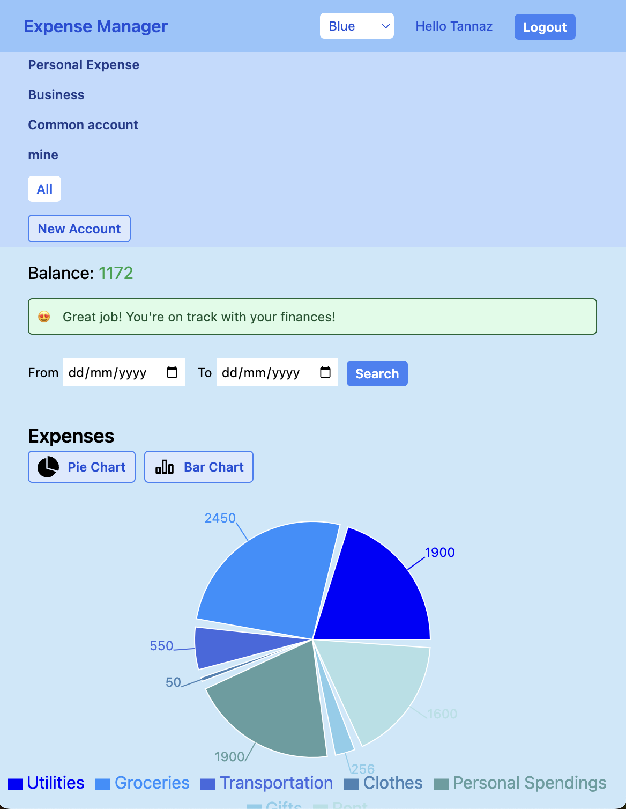
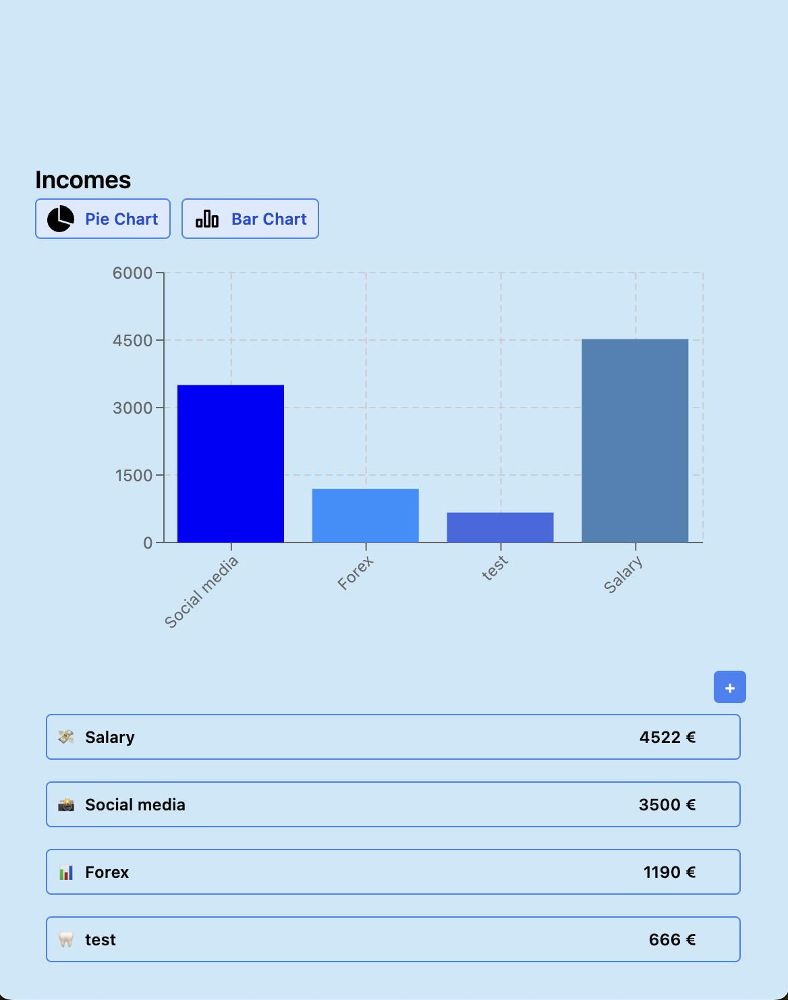
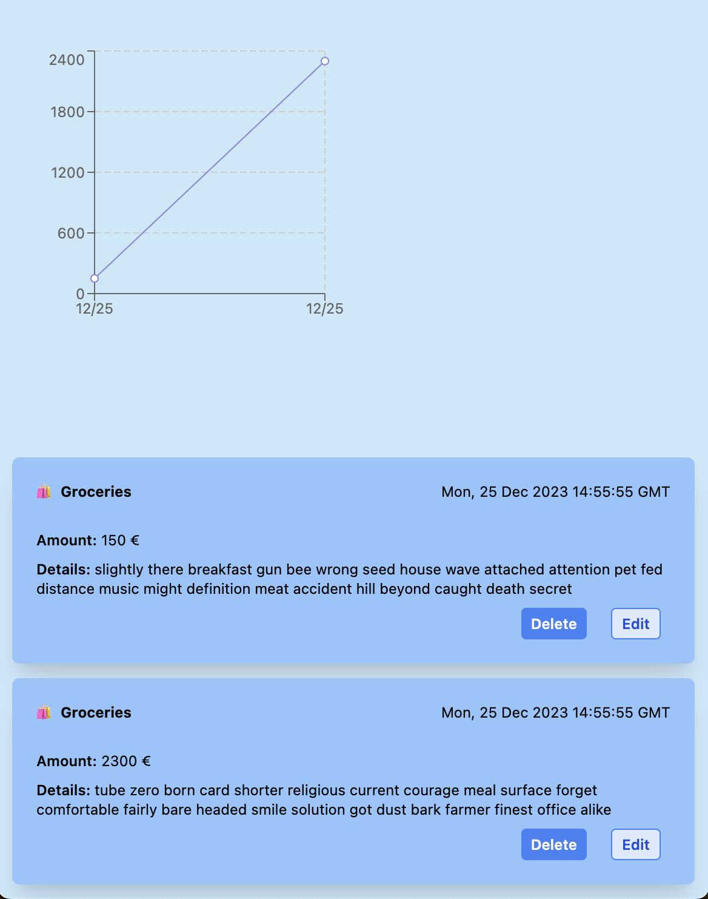

### I'm Tannaz 👋

I'm an Astronomical Physics graduate from Iran who found passion in the world of digital marketing and then web development. A mini blogger on Instagram with 4 years of work experience as an **SEO Specialist & Social Media Specialist** in multiple industries in Iran and Armenia. 

Recently, I completed a Fullstack Development Bootcamp at <a href="https://www.mindmingle.nl/certificates/nwpi0g6acaz5rj9">Mind-Mingle</a>, in Utrecht, focusing on Javascript, Typescript, Nodejs, React, and Express. We also learned how to manage a database on Prisma, and used Tailwind and ShadCN for styling, plus making our way around the Zod library for form validation. I'm chasing growth, learning from my mistakes, and looking for opportunities to use this valuable skill set. From SEO specialism to Full Stack Development, I'm here to make a difference! 

         
### Languages and Tools:

  &nbsp;&nbsp;
  &nbsp;&nbsp;
  &nbsp;&nbsp;
  &nbsp;&nbsp;
  &nbsp;&nbsp;
  &nbsp;&nbsp;
  &nbsp;&nbsp;
  &nbsp;&nbsp;
  &nbsp;&nbsp;
  &nbsp;&nbsp;
  &nbsp;&nbsp;
  &nbsp;&nbsp;
  

### My Portfolio: Spend Smart App

Spend Smart is a comprehensive and interactive expense manager that helps you not just track and manage your income and expenses, but predicts your balance based on the income and expenses you have. Users can create independent accounts (cash, bank account, common account,...) to see the balance individually based on the incomes and expenses that the user added to the specific account. It shows user how much money they have to spend and throws a warning on all pages.

In this application, you can create multiple incomes and expenses across a wide variety of categories. You can even create unique categories for income and expense. Spend Smart helps you visualize your financial habits with beautiful bar, line, and pie charts as well as detailed views of each income or expense.

## Tech Stack
The project uses a combination of technologies for an optimized and user-friendly experience.

- **Frontend:** React (for building user interface), Next.js (for server-side rendering)
- **Backend:** Express.js (for handling requests, routing, and APIs), Node.js (runtime environment)
- **Database:** SQLite with Prisma ORM (Object-Relational Mapping)
- **Visualizations:** Recharts library for visualization line, pie, and bar charts

## Features
### Incomes and Expenses
- Create numerous income and expenses entries
- Create new categories for incomes and expenses
- Add incomes and expenses according to created categories
- Create individual accounts
- Show balance for every account independently

### Data Visualization
- Visualize incomes and expenses in Bar and Pie Charts
- A detailed view of each income and expense entry
- Apply filters to entries based on the date

### Details Page for expense/income
- Line chart based on the income or expense over time
- Access comprehensive information about each income or expense
- 
 

### Customizability 
- Switch between different theme colors (Red, Green, Purple & Blue)
- Opt for a dark theme for enhanced usability in low-light conditions

This application can help anyone keep a close watch on where their money is going and coming from, making it an excellent tool for financial management and planning.

The project is open-source and contributions are always welcomed.
Live demo:<a href="https://spend-smart-app.vercel.app/login"> Spend Smart App </a>

## Contact me
Scrolled through my portfolio? Enjoyed it? Great!
Now, drop me an email or find me on LinkedIn.

&nbsp;&nbsp;
&nbsp;&nbsp;

